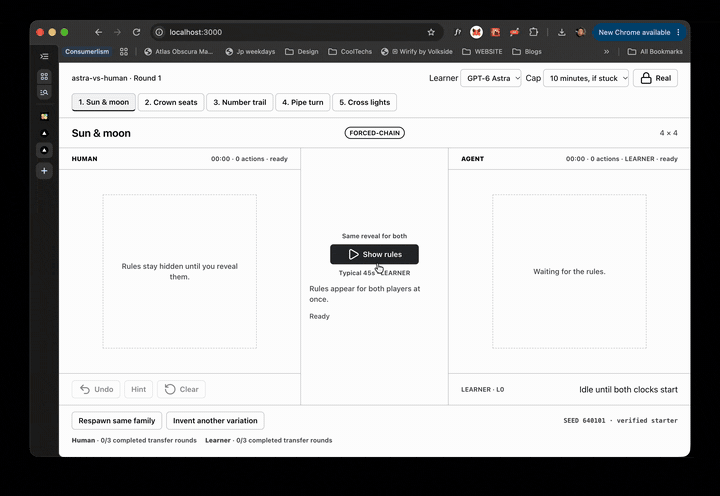

# astra-vs-human



**Are you cleverer than the agent, or is the agent just quicker?**

OpenAI × Lovable **GPT-6 Astra Hackathon London** · Tue 6 Oct 2026.

A human and one Learner each play the same rule pack and the same seed. Independent attempts. Shared board, shared clock. We score the local friend-pattern that carries to the next near-transfer board — not the puzzle class you recognised.

**Live:** [astra-vs-human.vercel.app](https://astra-vs-human.vercel.app) · **Lovable:** [paper-play-board.lovable.app](https://paper-play-board.lovable.app) · **1-min demo:** [Loom](https://www.loom.com/share/b549d07622694c8c9b1d9b31f2e38f60)

## How to run

Node 20+ and pnpm 11.

```bash
pnpm install
cp .env.example .env.local
pnpm dev
```

Open [http://localhost:3000](http://localhost:3000).

Put `OPENAI_API_KEY` in `.env.local` for live Learner calls. Optional `OPENAI_MODEL` defaults to `gpt-6-astra`. That file stays gitignored. Cached packs and `GET /api/pack` run without a key.

Offline checks (no paid model call):

```bash
pnpm check:puzzles
node scripts/check-battle-ground.mjs
node scripts/check-game-generator.mjs
node scripts/check-model-learner.mjs
node scripts/check-game-learner.mjs
```

## Fairness (Human | Agent)

- One pack and one returned seed for both sides. A fallback pack keeps its actual seed.
- Independent attempts. One board viewport. Human is the playable tab. Agent shows the Learner’s own attempt.
- Shared actions: `selectCell`, `cycle`, `undo`, `clear`. Each tap counts on that side.
- Shared clock. Learner inference time stays on the Learner clock.
- The next round stays locked until both finish or reach the shared action and time cap.
- Hints are practice-only. Scored rounds leave Hint off. The Learner receives the visible board, the postcard, and its earlier one-line claims.

## mini-game-rules and battle-ground-ui

| Track | Owns |
| --- | --- |
| `mini-game-rules` | Pack schema, generator, verifier, postcards, transfer families, action effects |
| `battle-ground-ui` | White board, craft tokens, Human\|Agent tabs, dual clocks, round lock |

A rules pack supplies props to the frame. It does not set layout or colours. Category renderers sit inside the frozen frame. See [docs/mini-game-rules.md](docs/mini-game-rules.md) and [handoffs/battle-ground-ui/README.md](handoffs/battle-ground-ui/README.md).

## Stack

- **Lovable / Cursor** — paper-craft UI. Cursor ports the Mac craft export. This lane does not restyle tokens.
- **Codex** — packs, verifiers, and `/api/pack` plus `/api/game-pack`.
- **Astra Learner** — `/api/learner` and `/api/game-learner`. Same eyes as the human. Default model `gpt-6-astra`.
- **Vercel** — [astra-vs-human.vercel.app](https://astra-vs-human.vercel.app)

Next.js 16.3 (App Router) · React 19.3 · TypeScript · Tailwind 4 · shadcn/ui · pnpm 11.

## Public repo and demo

- Repo (public): https://github.com/ghcpuman902/astra-vs-human
- Demo GIF: [docs/demo.gif](docs/demo.gif) (≈5s sped-up dual-arena loop)
- 60-second shoot sheet: [docs/DEMO-SCRIPT.md](docs/DEMO-SCRIPT.md)
- Submit list: [docs/SUBMIT-CHECKLIST.md](docs/SUBMIT-CHECKLIST.md)
- Learner model picker: [docs/MODEL-SELECTOR.md](docs/MODEL-SELECTOR.md)

Built tonight. Keys stay off the board, out of the repo, and out of the video.
