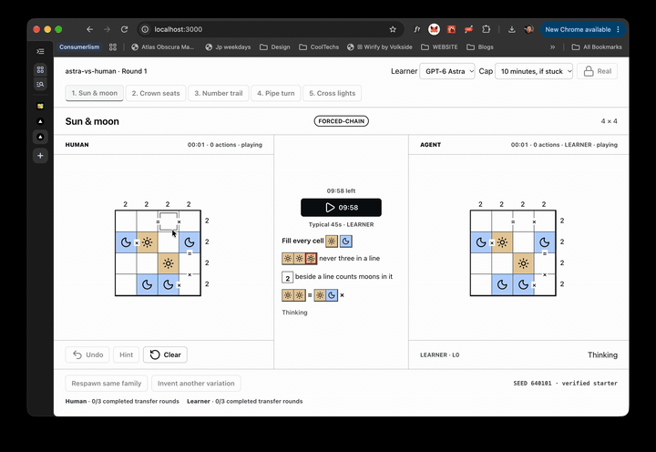

# astra-vs-human



**Are you cleverer than the agent, or is the agent just quicker?**

Play: [astra-vs-human.vercel.app](https://astra-vs-human.vercel.app) · Demo: [Loom](https://www.loom.com/share/b549d07622694c8c9b1d9b31f2e38f60) · Craft: [Lovable](https://paper-play-board.lovable.app)

**We score the pattern carried forward, not the class recognised.**

OpenAI × Lovable **GPT-6 Astra Hackathon London** · Tue 6 Oct 2026.

## How to run

Node 20+ and pnpm 11.

```bash
pnpm install
cp .env.example .env.local
pnpm dev
```

Open [http://localhost:3000](http://localhost:3000).

Put `OPENAI_API_KEY` in `.env.local` for live Learner calls. Optional `OPENAI_MODEL` defaults to `gpt-6-astra`. That file stays gitignored. Cached packs and `GET /api/pack` run without a key.

Offline checks (no paid model call):

```bash
pnpm check:puzzles
node scripts/check-battle-ground.mjs
node scripts/check-game-generator.mjs
node scripts/check-model-learner.mjs
node scripts/check-game-learner.mjs
```

## Fairness (Human | Agent)

- Match length is Deep (one family, five boards), Tour (one board from each family), or Blitz (3 minutes a side).
- Saved matches can still carry family marks (novel first, disliked later). The setup screen does not ask for them.
- Clocks, game marks, and Next live in the top bar. The boards stay put when you advance. Next only moves you.
- One pack and seed per round index. While the sides are on different rounds they see different boards.
- Independent attempts and clocks. Human finishing, skipping, or hitting a cap does not end or advance the Agent.
- Shared actions: `selectCell`, `cycle`, `undo`, `clear`. Each tap counts on that side.
- Each side's next round stays locked until that side finishes or reaches its own action and time cap.
- Hints are practice-only. Scored rounds leave Hint off. The Learner receives the visible board, the postcard, and its earlier one-line claims.

## mini-game-rules and battle-ground-ui

| Track | Owns |
| --- | --- |
| `mini-game-rules` | Pack schema, generator, verifier, postcards, transfer families, action effects |
| `battle-ground-ui` | White board, craft tokens, Human\|Agent progress, per-side clocks and advance |

A rules pack supplies props to the frame. It does not set layout or colours. Category renderers sit inside the frozen frame. See [docs/mini-game-rules.md](docs/mini-game-rules.md) and [handoffs/battle-ground-ui/README.md](handoffs/battle-ground-ui/README.md).

## Stack

- **Lovable / Cursor** — paper-craft UI. Cursor ports the Mac craft export. This lane does not restyle tokens.
- **Codex** — packs, verifiers, and `/api/pack` plus `/api/game-pack`.
- **Astra Learner** — `/api/learner` and `/api/game-learner`. Same eyes as the human. Default model `gpt-6-astra`.

The Learner sees that same public board. The selected model writes one cell or a short burst, a plan for Jev, Laya, or OpenAI Decisions, or one program this browser keeps and runs again. Those decision models can also choose from the board with no plan. We score the pattern carried forward, not the puzzle class recognised. Agent vs Agent runs two of these on independent clocks. No keys are stored in the repo.

## Learner credentials

Set these in Vercel or `.env.local`. This repo does not ship values.

| Name | Used for |
| --- | --- |
| `OPENAI_API_KEY` | Astra through OpenAI (`OPENAI_MODEL`, `OPENAI_ORG_ID` optional) |
| `AI_GATEWAY_API_KEY` | Astra and Jev through the Vercel AI Gateway / AI SDK |
| `VERCEL_OIDC_TOKEN` | Gateway auth on Vercel when the API key is unset |
| `TYPESAFE_API_KEY` | Jev direct `POST /v1/systemone` (`TYPESAFE_BASE_URL` optional) |
| `LAYA_API_KEY` | Laya direct `POST /v1/systemone` (Laya Studio unless `LAYA_BASE_URL` is set) |
| `IMPOSSIBL_API_KEY` | Laya on `https://api.impossibl.com` with model `convaiinnovations/laya` |
| `LAYA_BASE_URL` | Optional Laya origin. Overrides the default host |

`GET /api/learner-mix` reports only whether each credential is present.
- **Vercel** — [astra-vs-human.vercel.app](https://astra-vs-human.vercel.app)

Next.js 16.3 (App Router) · React 19.3 · TypeScript · Tailwind 4 · shadcn/ui · pnpm 11.

## Public repo and demo

- Repo (public): https://github.com/ghcpuman902/astra-vs-human
- Demo GIF: [docs/demo.gif](docs/demo.gif) (≈5s sped-up dual-arena loop)
- 60-second shoot sheet: [docs/DEMO-SCRIPT.md](docs/DEMO-SCRIPT.md)
- Submit list: [docs/SUBMIT-CHECKLIST.md](docs/SUBMIT-CHECKLIST.md)
- Learner model picker: [docs/MODEL-SELECTOR.md](docs/MODEL-SELECTOR.md)

Built tonight. Keys stay off the board, out of the repo, and out of the video.
